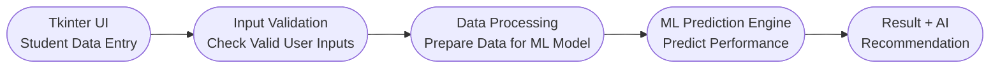

# Smart Student Performance Prediction System
## 1. PROBLEM STATEMENT:
- Student performance is influenced by multiple academic and behavioral factors.
- Faculty may find it difficult to identify students who are at risk at an early stage.
- A data-driven system can help predict student performance.
- The system can provide recommendations for improving student outcomes.
## 2. PROPOSED SOLUTION:
- Collect student-related information.
- Process the entered data.
- Use a Machine Learning model to predict performance.
- Classify students based on predicted performance.
- Generate intelligent recommendations.
- Display the results through a user-friendly Tkinter interface.
## 3. PROCESS FLOW:
```text
           Start
             ↓
    Enter Student Details
             ↓
       Validate Input
             ↓
       Preprocess Data
             ↓
       ML Prediction
             ↓
  Determine Performance Level
             ↓
  Generate AI Recommendation
             ↓
        Display Result
             ↓
            End
```
## 4. PROJECT MAPPING:
|V-Model Stage|	Smart Student Project|
|---|---|
|Requirement Analysis|Identify student performance problem|
|System Design|Design system architecture and UI|
|Implementation|Develop Python + ML application|
|Integration|Integrate UI, ML and AI|
|Testing|Test individual modules and complete system|
|Validation|Check system against requirements|
|Demonstration|Present working capstone|
## 5. PROJECT - MODULAR APPLICATION DEVELOPMENT:
Create separate functions:
```
text
get_student_data()
calculate_average()
calculate_performance()
display_result()
```
# 6. REQUIREMENT ANALYSIS:
## 6.1 FUNCTIONAL REQUIREMENTS:
The system should:

- Accept student details.
- Validate user inputs.
- Store/process student information.
- Preprocess input data.
- Apply the trained ML model.
- Predict student performance.
- Generate recommendations.
- Display results through the GUI.
- Handle invalid inputs.
- Provide a reset/clear option.
## 6.2 NON-FUNCTIONAL REQUIREMENTS:
The application should be:

- User-friendly
- Easy to understand
- Fast in generating predictions
- Reliable
- Maintainable
- Scalable
- Secure with respect to student data
- Easy to test
## 6.3 IDENTIFY THE USER:
Primary users may include:

- Faculty
- Academic coordinators
- Mentors
- Students
## 6.4 USER REQUIREMENT:
The user should be able to:

- Enter student information.
- Submit the information for analysis.
- View predicted performance.
- Understand the student's risk level.
- Receive improvement recommendations.
## 6.5 IDENTIFY SYSTEM INPUTS:
The initial system can use:

- Student ID
- Student Name
- Attendance Percentage
- Study Hours per Day
- Internal Assessment Marks
- Assignment Completion Percentage
- Previous Academic Performance
## 6.6 IDENTIFY SYSTEM OUTPUTS:
### 6.6.1 PERFORMANCE PREDICTION:
- Excellent
- Good
- Average
- At Risk
### 6.6.2 ADDITIONAL OUTPUT:
- Prediction score/probability
- Risk level
- Key factors affecting performance
- Recommended actions
# Example:
Prediction: Good Performance

Risk Level: Low

Recommendation: Maintain current study pattern and attendance

# 7. From Requirements to System Design

## 7.1.Inputs
- Student ID
- Student Name
- Attendance %
- Study Hours
- Internal Marks
- Assignment Completion %
- Previous Academic Performance
## 7.2.Processing
- Validate input
- Preprocess data
- Send data to ML model
- Generate prediction
- Generate recommendation
## 7.3.Outputs
- Predicted performance
- Performance category
- Risk level
- Recommendation

# 8.Proposed System Architecture


# 9.UI Design Requirements
The application should contain:
## 1.Student Information Section
- Student ID
- Student Name
## 2.Academic Information Section
- Attendance
- Study Hours
- Internal Marks
- Assignment Completion
- Previous Performance
## 3.Action Section
- Predict Performance
- Clear
- Exit
## 4.Result Section
- Predicted Performance
- Risk Level
- Recommendation

# 10.Workflow
```
User clicks Predict
        ↓
Button generates event
        ↓
Callback function executes
        ↓
Python processing starts
```
# 11. Using Frames

## The main window:

- Header frames
- student information
- Academic information
- Header frame
- Results frame
# 12.Requirements Design 


# 13.OUTCOMES

## Should complete:
- Dataset (CSV file)
- Data preprocessing code
- Trained ML model
- Accuracy report
- Prediction function
- Saved model file (.pkl)
# 14.Traditional Programming vs Machine Learning

| Traditional Programming | Machine Learning |
|:------------------------:|:----------------:|
| Rules are written manually | Model learns rules from data |
| Output = Logic + Input | Output = Model + Input |
| Fixed logic | Adaptive learning |
# 15.ML Workflow
```
    Data Collection
         ↓
   Data Preprocessing
         ↓
  Feature Selection
         ↓
    Model Training
         ↓
  Model Evaluation
         ↓
     Prediction
```
# 16.ML WORKFLOW

## Activity 1-Dataset Creation
- Create student dataset in CSV
- Add 20-50 records
## Activity 2 - Data Loading
- Load dataset using Pandas
- Display dataset
## Activity 3-Data Cleaning
- Remove missing values
- Check data types
## Activity 4 - Model Training
- Train Logistic Regression model
- Split dataset
## Activity 5 - Model Evaluation
- Calculate accuracy
- Analyze results
## Activity 6 - Prediction
- Test model with new input
## Activity 7 - Save Model
- Save model using pickle
